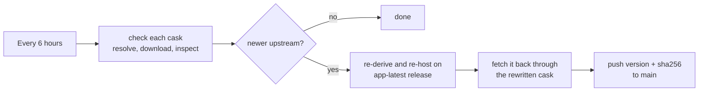

<div align="center">

# edbfi/taps

**One Homebrew tap for macOS apps that homebrew-cask does not carry.**

[](LICENSE)
[](#-support-the-developers)

</div>

Every cask here re-hosts an upstream build on this repository's releases and is updated by a shared pipeline every six hours. Apps that Gatekeeper would block are de-quarantined on install, so they open like anything else.

## 💛 Support the developers

This tap only re-packages other people's work. If an app earns a place in your Dock, send something to the person who builds it. Each cask prints this reminder on install and on every upgrade.

| App | Support upstream |
| --- | --- |
| **Flixor** | [](https://ko-fi.com/flixor) |
| **Fred TV** | [](https://github.com/sponsors/Fredolx) [](https://paypal.me/fredolx) [](https://github.com/Fredolx/open-tv#donate-crypto-thank-you) |
| **Paicord** | [](https://github.com/sponsors/llsc12) |
| **FCast Sender** | No donation page. [Star the project](https://github.com/futo-org/fcast), file bugs, contribute. |
| **qView** | No donation page. [Star the project](https://github.com/jurplel/qView), file bugs, contribute. |
| **qBittorrent** | [Donate to the developers and server costs](https://www.qbittorrent.org/donate) |

**Support this tap.** The pipeline, hosting, and upkeep are done by [@edbfi](https://github.com/edbfi). Monero is welcome:

[](#-support-the-developers)

```text
8Awh9TSyJPZT99RWbVpd6sDLKNCLAWKm5M6chez7T1emhJDJXdoX583bzVRHjpn2Ej7jFqn3fEzkBMYYBFax5vqj97MvC72
```

## Apps

| App | macOS cask | Linux formula |
| --- | --- | --- |
| [FCast Sender](https://fcast.org/) | Apple Silicon, macOS 11+ | ARM64 / x86_64 |
| [Flixor](https://github.com/Flixorui/flixor) | Universal, macOS 13+ | — |
| [Fred TV](https://github.com/Fredolx/open-tv) | Universal; installs `mpv`, `ffmpeg` and `yt-dlp` | ARM64 / x86_64 |
| [Paicord](https://github.com/llsc12/Paicord) | Universal, macOS 14+ | — |
| [qBittorrent](https://www.qbittorrent.org/) | Universal, macOS 13+ | — |
| [qView](https://github.com/jurplel/qView) | Universal, macOS 12+ | ARM64 / x86_64 |

Install with `brew install --cask edbfi/taps/<app>` on macOS or `brew install --formula edbfi/taps/<app>` on Linux; tokens are `fcast-sender`, `flixor`, `fredtv`, `paicord`, `qbittorrent` and `qview`. Name the package kind where both exist. "Universal" means the bundle contains ARM64 and x86_64 code; Intel runtime is largely untested. An app's minimum macOS version is not a promise of Homebrew support on that version; see [platform support](docs/platform-support.md) for tested versions and limits.

Casks live in `Casks/<category>/`: `media/` holds FCast Sender, Flixor, Fred TV and qView; `network/` holds qBittorrent; `social/` holds Paicord. The category is only a folder; the install command never changes.

### App notes

- **qBittorrent** packages the standard stable desktop DMG (Qt 6/libtorrent 1.2), not the separate `qbittorrent-cli` client or `lt20` variant. Upstream signs the universal `qbittorrent.app` with its own self-issued certificate, not an Apple Developer ID, so the cask installs it as `qBittorrent.app` and removes quarantine after installation. Updates wait until the latest stable release includes the standard DMG. If migrating from Homebrew's disabled macOS cask, run `brew uninstall --cask homebrew/cask/qbittorrent` without `--zap`, then `brew install --cask edbfi/taps/qbittorrent` to preserve settings and torrent state.
- **FCast Sender**'s upstream macOS DMG contains only an ARM64 main executable, so the cask doesn't support Intel Macs. The app is signed and notarized by FUTO, so no quarantine workaround is applied. Versions drop the pre-release suffix the upstream tag carries: `sender-0.0.3-beta` becomes `0.0.3`.
- **Flixor** versions match upstream tags such as `beta2.4.0`. The app bundle is `FlixorMac.app`.
- **Fred TV** depends on the `mpv`, `ffmpeg` and `yt-dlp` formulae, which Homebrew installs alongside it. Versions strip a leading `v` (`v1.9.1` becomes `1.9.1`).
- **Paicord** uses the immutable upstream release belonging to the newest successful main build. Each cask version is `YYYY-MM-DD-<short sha>`; the release tag must match that exact build commit.

  > [!WARNING]
  > Paicord is an unofficial, third-party Discord client. Using it violates Discord's Terms of Service and your account may be suspended or banned. **Use at your own risk.**

- **qView** is disabled in the official homebrew-cask repository because of a Gatekeeper check. This cask removes the `com.apple.quarantine` attribute after install, so the app launches without a manual `xattr`.

Flixor, Fred TV, Paicord and qView are distributed unsigned upstream; each of those casks runs a `postflight_steps` block that strips the quarantine attribute from the installed app.

## Install, update, uninstall

Run `brew update` before installing. Use the cask token from the [Apps](#apps) table (e.g. `fcast-sender`) for `<app>` below.

```bash
# Install (taps the repository automatically)
brew install --cask edbfi/taps/<app>

# Or tap first, then install by short name
brew tap edbfi/taps
brew install --cask <app>

# Update
brew upgrade --cask <app>

# Uninstall
brew uninstall --cask <app>

# Uninstall and remove application data
brew uninstall --cask --zap <app>

# Remove the tap
brew untap edbfi/taps
```

## Linux packages

qView, Fred TV and FCast's desktop Sender have Linux formulae for ARM64 and x86_64; Flixor, Paicord and qBittorrent are macOS-only in this tap. They build from source with Homebrew's default prefix, `/home/linuxbrew/.linuxbrew`; no Linux bottles are published yet, and Fred TV stays source-only pending upstream license clarification. Rust builds can take tens of minutes and several GB of disk. Formula source updates require a reviewed PR.

```sh
brew install --formula edbfi/taps/qview
qview picture.png
brew upgrade --formula edbfi/taps/qview
brew uninstall --formula edbfi/taps/qview
```

The other launch commands are `fredtv` and `fcast-sender`; desktop entries use absolute Homebrew paths, and Fred TV's wrapper finds its media tools from menu launches too. To show the launchers and icons in your desktop menu, add this to your session's environment and log in again:

```sh
export XDG_DATA_DIRS="/home/linuxbrew/.linuxbrew/share:${XDG_DATA_DIRS:-/usr/local/share:/usr/share}"
```

Your desktop supplies X11 or Wayland, a session D-Bus and audio; FCast screen sharing also needs PipeWire and a compatible `xdg-desktop-portal` ScreenCast backend. The tap installs a GStreamer PipeWire plugin but starts no session services. Uninstalling removes the launcher, desktop entry, icons and binaries and keeps settings and recordings; formulae have no `--zap`. Review unused dependencies with `brew autoremove --dry-run`. Don't run the GUI apps with `sudo`. See [platform support and historical validation](docs/platform-support.md) for source versions, desktop requirements and untested hardware features.

## How it works



- [`update-casks.yml`](.github/workflows/update-casks.yml) runs the stages in `scripts/update.sh` every six hours, or on dispatch for one cask. `scripts/discover.sh` lists the cask-enabled `pipelines/<app>/` directories.
- `pipelines/<app>/resolve.sh` is the only app-specific code: it finds the newest upstream build and validates the tag and asset name strictly before anything else runs.
- An update needs an upstream version newer than the cask's (`sort -V`). A macOS job downloads the DMG, hashes it and checks the bundle's identity and architectures. A second job, holding the release write access, repeats the lookup and download itself, requires the same checksum, and attaches the DMG to the rolling `<app>-latest` release. Published downloads are never replaced. A macOS job then fetches the hosted file through the rewritten cask, and only then does a last job push the new `version` and `sha256` lines straight to `main`, with a deploy key that may bypass the required checks.
- A failing cask turns the run red without stopping the others. Retry with a new run: it redoes whatever is missing, and publishes nothing twice. Versions that `sort -V` can't order (a downgrade, two Paicord builds of one day, Flixor leaving its `beta` prefix) and a current version whose hosted DMG went missing need a human.
- CI runs on every PR, each push to `main` and weekly. It runs the prek hooks (`bash -n`, shellcheck and both offline test trees), `scripts/check-casks.sh` on macOS (`brew readall`, `brew style`, `brew audit --cask`) and `scripts/check-formulae.sh` on Linux x86_64 and ARM64, which builds and tests the changed formulae (all of them weekly). Run the same commands locally: `prek run --all-files --hook-stage manual`, `bash scripts/check-casks.sh`, `bash scripts/check-formulae.sh`.

Releases: <https://github.com/edbfi/homebrew-taps/releases>

## Adding a cask

Three files:

1. `Casks/<category>/<app>.rb` with `url` pointing at `releases/download/<app>-latest/<Prefix>-#{version}.dmg` and a donation `caveats` block.
2. `pipelines/<app>/config.env` with the display name, upstream repo, asset prefix and donation links.
3. `pipelines/<app>/resolve.sh` that writes `version` and `download_url` (see the existing resolvers and the contract at the top of `scripts/resolve.sh`).

Then register the app's bundle name, identifier and architectures in `scripts/inspect-macos.py` and add resolver fixtures to `scripts/tests/test_pipeline.py`. CI finds the new cask on its own.

`bash scripts/discover.sh` should then list the new app, and `GH_TOKEN=$(gh auth token) bash scripts/resolve.sh <app>` should print its current version.

## License and attribution

This is an unofficial, community-maintained tap, not affiliated with any of the upstream developers. The tap itself is licensed under [AGPL-3.0](LICENSE). The apps keep their own licenses:

| App | Upstream license |
| --- | --- |
| FCast Sender | [MIT](https://github.com/futo-org/fcast/blob/master/LICENSE); the Linux formula also installs under [GPL-3.0](https://github.com/futo-org/fcast/blob/master/senders/extra/LICENSE-GPL), Slint's GPL option |
| Flixor | [Flixor Public License](https://github.com/Flixorui/flixor/blob/main/LICENSE.md) |
| Fred TV | [GPL-2.0](https://github.com/Fredolx/open-tv/blob/main/LICENSE) |
| Paicord | [GPL-3.0](https://github.com/llsc12/Paicord/blob/main/LICENSE) |
| qBittorrent | [GPL-3.0-or-later binary distribution, with OpenSSL exception](https://github.com/qbittorrent/qBittorrent/blob/release-5.2.3/COPYING) |
| qView | [GPL-3.0](https://github.com/jurplel/qView/blob/main/LICENSE) |
| PipeWire GStreamer plugin (Linux) | [MIT](https://gitlab.freedesktop.org/pipewire/pipewire/-/blob/master/COPYING) |
